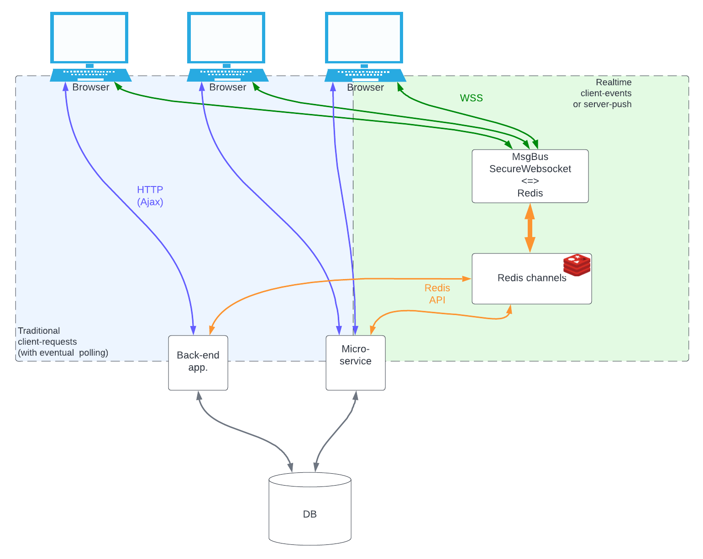

# Message bus 

The principle of request-reply is at the core of web-applications since they exist.  
It is great but comes with some limitaions:

1. Data displayed is not realtime: After your request for a data, if it changes server-side, your app., your user won't know until the next request.
2. No server events: You server can only send something to your user when your user takes the initiative.
3. No peer-to-peer events: a user app. cannot communicate with another user app. (at least not realtime, and not without using your back-end server wich has probably other things to do than route user-to-user messages).

Attempts to work-around those inherent limitations exist, but usually involve polling (or long-polling) systems, which put a serious additional strain on your backend server. These are therefore always of a limited use, and not really scallable.

Without questionning the request-reply model, the use of a realtime messagebus alongside can prove very complementary.

This can be done with technologies which are now part of all major browsers, and mature enough to be deployed in secure, large, production environments. 
- Secure Websockets on top of HTTPS (same domain, same port 443), 
- WebWorkers : Running in a different browser thread than your js app, their data is inaccessible from it or from the console.
- Server-side messaging brokers like Redis, RabbitMQ, MQTT, Active MQ and many other, offer stable, fast, scalable message routing and queuing.



## The messageBus plugin of Sparc :
The message bus plugin of Sparc, together with it's server Node.js counterpart and a Redis-broker do exactly that : 
It basically allows your browser app. to connect to Redis Pub-Sub channels, server-side.

It then becomes possible for your browser app. to send realtime messages to another user, or group of other users, or to any server-side back-end application or micro-service. But more interestingly, any server-side back-end application or micro-service can send realtime data or events to any browser app., user (maybe a user is using your app in several browsers or tabs), or groups of users.

The messageBus plugin for Sparc takes care of all communication gory details (Re-connections, keep-alive, auto-reconnection, subscriptions management,...).
It offers a simplified yet powerfull API to tour app.

## Configuration

* `enabled` :  **Boolean** : When false, the messageBus is ...disabled ;-)
* `pathToWorker"` : **String** : This lib also uses a webworker which cannot be launched through the normal dependency system. This is the path to the worker script.  
Standard value is ***"/core/libs/MessageBusWorker.js"***.
* `protocol"` : The protocol part of the URL to the websocket server.
Standard value is ***"wss:"***.
* `host"` : The host part of the URL to the websocket server. If absent or empty, the host will be extracted from the current browser's URL (same URL is a requirement often imposed by the browser, firewalls, proxies... anyway)
* `port"` : The port part of the URL to the websocket server
* `path"` : The (Where the HTTP-Upgrade will take place)
* `connectTimeout` : ***Float*** : If the server remains silent at a connection attempt, connection will timeout after this many seconds.  
**Caution** : If ***autoReconnect*** is > 0, the  Auto-reconnect will occur after ***connectTimeout + autoReconnect*** seconds, unless the door is immediately slammed in your face right away (then ***autoReconnect*** seconds). If your WSS server is hidden behind an Nginx (which you should really do in prod.), you should also pay attention to the Nginx parameters ***proxy_connect_timeout, proxy_send_timeout and proxy_read_timeout*** 
* `autoReconnect` : ***Float*** : If zero (or false): no auto-reconnect upon connection loss. Otherwise, the time, in seconds (decimals ok), before he FIRST reconnecting attempt. (ex: 5 seconds)
* `autoReconnectTimeFactor` : ***Float*** : on every successive reconnection failure, the auto-reconnect time is multiplied by this factor, to avoid reconnect-spamming when the WSS server is down. 
* `autoReconnectTimeMax` : ***Float*** : The ceiling value for the auto-reconnect time. 
For example with ***autoReconnect:5, autoReconnectTimeFactor:2 , autoReconnectTimeMax:60***, attempts would occur at ***(connection loss) + 5sec, + 10sec, +20sec, +40sec then every minute***)
* `autoReconnectJitterPercent` : ***Float*** : If your websocket server goes down, all clients are loosing connection precisely at the same time. Therefore, their reconnection attempts will be synchronized, which is not what you want when you'll bring your WSS server back up !  
If this parameter is non-zero, it represents the percentage of random "jitter" applied on the next reconnect time. For example: with a reconnect time of 30 sec, and ***autoReconnectJitterPercent:10 *** : the actual reconnection will occur between 28.5 and 31.5 seconds later.


```json
    "messageBus":{
        "enabled": true,
        "pathToWorker": "/core/libs/MessageBusWorker.js",
        "protocol": "wss://",
        "port": "",
        "path": "/msgbus",
        "connectTimeout": 5,
        "autoReconnect": 5,
        "autoReconnectTimeFactor": 1.3,
        "autoReconnectTimeMax": 30,
        "autoReconnectJitterPercent": 10
    }
```


## Methods

- `whenConnected`
`callback` **function** : Will be called when the connection is established.  
If called several times (normally with different callbacks), all the callbacks are queued  and will be executed in order when the connection is ready.  

- `ifConnected`
`callback` **function** : Will be called if the connection is already established. 
If messageBus is not connected at the time of calling the method, the callback will never be used.  

- `executewhenConnectedQ`
You should not call this function directly. It is called internally when the connection becomes ready, to execute the 'TODO-List' created via `whenConnected`.  

- `subscribe` : Asks the server to subscribe  to Redis channels. It uses these arguments:  
    - `chans` **Array of Strings**: the list of channels you want to subscrie to.   
    - `callBack` **function**: Called when the server has answers the 'SUB' Action, sent by this method.
    The callback argument will be the json packet sent back by the server.
    In the case of a subscribe, it will contain the list of current subscriptions.

```text
Note about the subscription list your will receive:
- If channels you requested are not in the list, it means they were rejected by the server.
  (The chan not allowed to this user).
- If you see a channel you did not request, this can either mean that you had
  already subscribed to it before,
  or that you were automatically subscribed by the server upon connection (mandatory channels)
```

- `getSubscriptions` : Asks the server for currently subscribed channels.
    - `callBack` **function**: Called when the server has answers the 'SUB' Action, sent by this method.
    The callback argument will be the json packet sent back by the server containing the list of current subscriptions.


- `send` : Publishes a message on a channel.  It uses these arguments:  
    - `chan`: **String** The chan on which to publish.
    - `message`: **Object** The Object you want to send as message.

    **Caution** : The object will be JSONified and is not binarry-safe.  
    At this time, MessageBus has not provisions for binary data transmition.  
    If you need to send binary data anyway, consider using Base64 encoding : Inefficient but will work.


- `receiveFromWorker`: Internal function that shall not be used by the app.

- `receiveFromServer`: Internal function that shall not be used by the app.


## Events
Once enabled, the MessageBus will start to dispatch events ***on the document*** :

- `MessageBus.Connected`
Dispatched when the bus connection to the back-end is established.
The event object has nothing in ***'detail'***

**Caution** : If you want to use this event, be ready to manage connection-lost => auto-reconnection(s) scenari !

On the other hand, if you just want to trigger some action when the connection is available,  
you can use the `whenConnected` callback registration method instead.


- `MessageBus.Closed` 
Dispatched when the bus connection was lost.
The event object has nothing in ***'detail'***

- `MessageBus.Message`
Dispatched when the bus has received a message from one of the subscribed channels.
You'll find the message payload in ***event.detail***
It will look something like:


```json
    {   
        "msg":"Hello world !",
        "chan":"nike_chan"
    }
```
**About msg** : In this example, the message is a simple **String**. If some json **Object** was sent, it comes already parsed for you. (thus as a javascript Object).


- `MessageBus.[ACTION]`
    Every action requested on the message bus via the propoer method (like 'SUB' for subscribe, 'UNSUB' for unsubscribe, etc), will trigger an event upon completion.
    the event name follows the name convention `MessageBus.[ACTION]` where **[action]** is the requested action.  
    For example, If you cal the method  `getSubscriptions`, it will launch an action **'SUBLST'** towards the server.  
    Upon completeion, an event `MessageBus.SUBLST` will be triggered.  
    In this example, the **event.detail** will look like :


```json
    ["authorizer_chan","ProposalUpdate_chan","userchan_n642642"]
```
     
